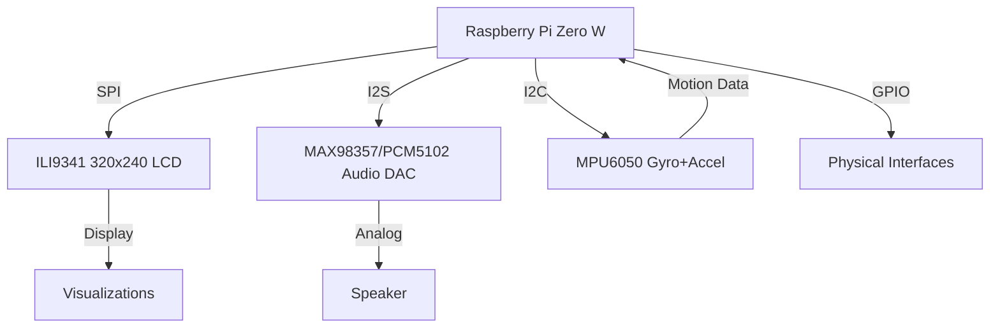

# osga : Organic Sound Generation Architecture


** osga is work in progress. **

## Overview

osga is non-musical sound computer. 

## Features

- Modular Lua-based scripting system
- Multi-sensor integration (IMU, touch)
- Embedded graphics subsystem
- Web interface for remote control
- Expandable hardware architecture

## Hardware Architecture



## Installation

### System Setup

```bash
cd ~
wget https://raw.githubusercontent.com/hugelton/osga-setup/main/install.sh
chmod +x install.sh
./install.sh
sudo reboot
```

### Hardware Requirements

| Component           | Interface | Purpose                   |
| ------------------- | --------- | ------------------------- |
| ILI9341 LCD         | SPI       | Visual feedback system    |
| MPU6050             | I2C       | Motion sensing            |
| MAX98357/PCM5102    | I2S       | High-quality audio output |
| Raspberry Pi Zero W | -         | Main computing unit       |

## Project Structure

```
osga/
├── osga-kage/    # Display subsystem (TFT graphics)
├── osga-nami/    # Audio synthesis engine
├── osga-koto/    # Sensor interface layer
├── osga-torii/   # Web server interface
└── osga-kumo/    # Home automation integration
```

## Sublications (Modules)

Create modular components with this structure:

```
MyModule/
├── main.lua      # Core logic
├── icon.png      # 32x32px module icon
└── info.json     # Metadata descriptor
```

### Example Module (Block)

```lua
block = {}

function block.init()
  -- Initialization logic
end

function block.draw()
  kage.clear(0)
  kage.drawBox(0,0,squareSize,squareSize)
  kage.draw()
end

function block.update()
  -- Frame-based updates
end
```

## Development

## License

This project is licensed under the **GNU General Public License v3.0**. See [LICENSE](LICENSE) for full terms.

## Community

- Report issues: [GitHub Issues](https://github.com/hugelton/osga/issues)
- Hardware designs: [osga-hardware](https://github.com/hugelton/osga-hardware)
- Discussion forum: [OSGA Discourse](https://github.com/hugelton/osga/discussions/)
