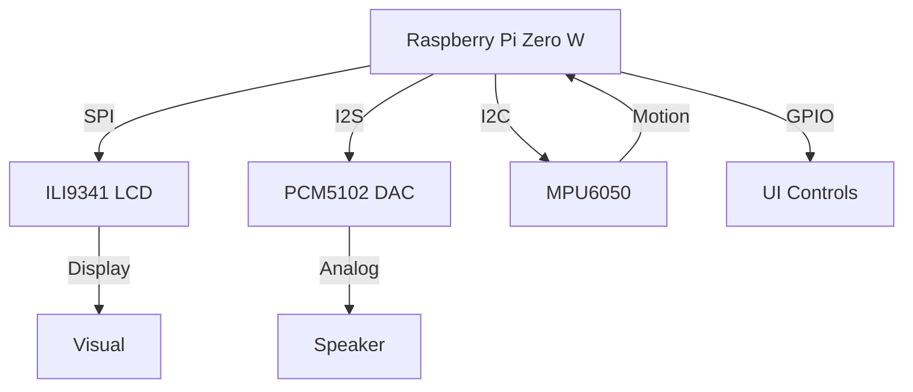

# osga : Organic Sound Generation Architecture


**osga is work in progress.**


## Overview

osga is non-musical sound device. A computer that allows you to program sound and vision. 

## Features

- Modular Lua-based scripting system
- Audio output via I2S DAC
- Visual feedback via LCD
- Motion sensing with IMU
- Web interface

## Hardware Architecture



## Installation

```bash
cd ~
wget https://raw.githubusercontent.com/hugelton/osga-setup/main/install.sh
chmod +x install.sh
./install.sh
sudo reboot
```

## Project Structure

```
osga/
├── osga-kage/    # Display subsystem
├── osga-nami/    # Audio engine
├── osga-koto/    # Sensor interface
├── osga-torii/   # Web interface
└── osga-kumo/    # Home screen 
```

## Module Example

```lua
block = {}

function block.init()
  -- Initialization
end

function block.draw()
  kage.clear(0)
  kage.drawBox(0,0,squareSize,squareSize)
  kage.draw()
end

function block.update()
  -- Updates
end
```

## License

This project is licensed under the **GNU General Public License v3.0**. See [LICENSE](LICENSE) for full terms.

## Community

- Issues: [GitHub Issues](https://github.com/hugelton/osga/issues)
- Hardware: [osga-hardware](https://github.com/hugelton/osga-hardware)
- Forum: [OSGA Discourse](https://github.com/hugelton/osga/discussions/)
